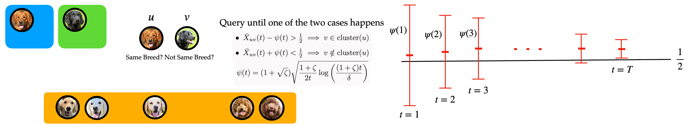

# Crowdsourced Clustering via Active Querying: Practical Algorithm with Theoretical Guarantees



This repository provides code for the simulations and experiments in our paper: [Crowdsourced Clustering via Active Querying: Practical Algorithm with Theoretical Guarantees](https://www.deepneural.network/publications/pdfs/hcomp23.pdf) @ The Eleventh AAAI Conference on Human Computation and Crowdsourcing (HCOMP 2023).

## Structure
The root of the codebase contains 5 directories.
1. `backend` contains code for the backend (removed in revised version due to space limits).
2. `csv` contains data in `csv` format, generated from the experiments run using the backend.
3. `mat` contains data in `mat` format, generated from the experiments run using the backend and simulation.
4. `notebook` contains files that used to visualize data obtained from the experiments.
5. `simulation` contains code to generate simulated results.

## Environment
### Simulation
The required packages and their corresponding packages are located in `environment.yml`. You first need to make sure the
required packages are installed. One easy way to do so is to use `Anaconda` to create an environment directly:
```
conda env create -f environment.yml
```
This will create an environment named `active-querying`. To active this environment, run
```
conda activate active-querying
```

## Usage
### Simulation
The files related to the simulation are located in the `simulation` directory.
There are two python files whose name starting with `executor`. These two files are the entry point for the simulation.

- The file `executor_all_sports.py` runs simulation using the results obtained from the all sports experiment.
- The file `executor_yun_14.py` runs simulation on the simulated dataset that was created for the yun 14 simulation.
- The file `executor.py` runs the simulation in general.
- Outputs of the simulation are stored in the `outputs` directory.
- Directory `yun14-related` contains files related to simulations regarding yun14 algorithm.
  - `clusering.py`  contains the implementation of yun14.
  - `passive_simulation[].ipynb` are used to generate adjacency matrix, frequency matrix, or observation matrix for
    simulation.
  -  `yun14_passive_all[].ipynb` runs the yun14 passive simulation.
  - `adpative_simulation.ipynb` runs the yun14 adaptive on simulated dataset.
  - `adpative_allsports.ipynb` runs the yun14 adaptive on allsports dataset.

The parameters related to the simulation can be set in the `main()` function in the two files.

## Citation

If you find our repository useful for your research, please consider citing our paper:
```
@article{Chen_Vinayak_Hassibi_2023, title={Crowdsourced Clustering via Active Querying: Practical Algorithm with Theoretical Guarantees}, volume={11}, url={https://ojs.aaai.org/index.php/HCOMP/article/view/27545}, DOI={10.1609/hcomp.v11i1.27545}, abstractNote={We consider the problem of clustering n items into K disjoint clusters using noisy answers from crowdsourced workers to pairwise queries of the type: “Are items i and j from the same cluster?” We propose a novel, practical, simple, and computationally efficient active querying algorithm for crowdsourced clustering. Furthermore, our algorithm does not require knowledge of unknown problem parameters. We show that our algorithm succeeds in recovering the clusters when the crowdworkers provide answers with an error probability less than 1/2 and provide sample complexity bounds on the number of queries made by our algorithm to guarantee successful clustering. While the bounds depend on the error probabilities, the algorithm itself does not require this knowledge. In addition to the theoretical guarantee, we implement and deploy the proposed algorithm on a real crowdsourcing platform to characterize its performance in real-world settings. Based on both the theoretical and the empirical results, we observe that while the total number of queries made by the active clustering algorithm is order-wise better than random querying, the advantage applies most conspicuously when the datasets have small clusters. For datasets with large enough clusters, passive querying can often be more efficient in practice. Our observations and practically implementable active clustering algorithm can inform and aid the design of real-world crowdsourced clustering systems. We make the dataset collected through this work publicly available (and the code to run such experiments).}, number={1}, journal={Proceedings of the AAAI Conference on Human Computation and Crowdsourcing}, author={Chen, Yi and Vinayak, Ramya Korlakai and Hassibi, Babak}, year={2023}, month={Nov.}, pages={27-37} }
```

